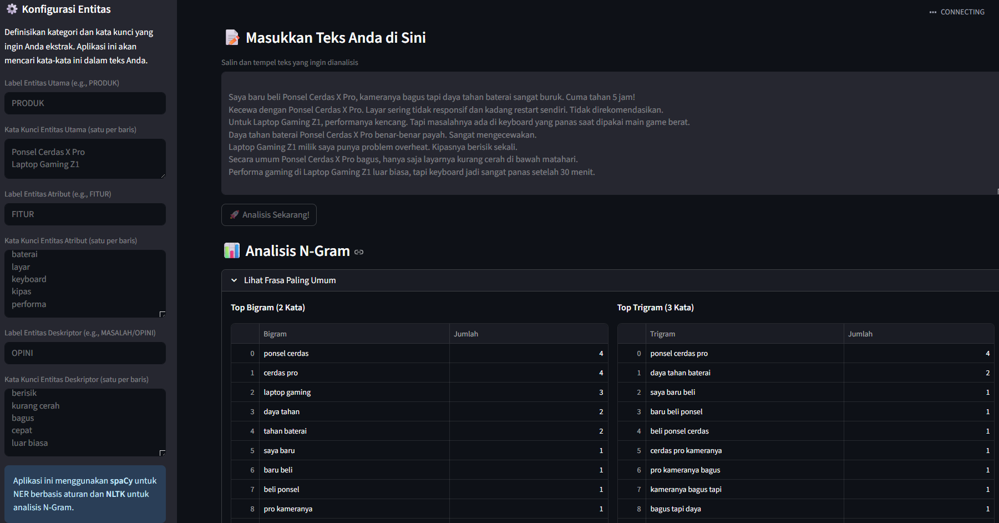

#  Info extract 
# 🔎 Extractor Informasi Cerdas

Aplikasi web serbaguna yang dibangun dengan Streamlit untuk menganalisis teks tidak terstruktur dan mengekstrak informasi penting secara otomatis. Aplikasi ini menggunakan teknik Natural Language Processing (NLP) untuk mengidentifikasi entitas kunci dan hubungannya, lalu menyajikannya dalam format tabel yang mudah dipahami.

[](https://share.streamlit.io/user/pratama404)

## 🚀 Demo Aplikasi Langsung

Anda bisa mencoba aplikasi ini secara langsung di:
**[➡️ Live Demo Aplikasi](https://information-extraction-ner-n-gram.streamlit.app/)**

---

## 📸 Tampilan Aplikasi



---

## ✨ Fitur Utama

* **Konfigurasi Entitas Dinamis:** Pengguna dapat mendefinisikan sendiri entitas dan kata kunci yang ingin dicari (misalnya Produk, Fitur, Masalah).
* **Analisis N-Gram:** Menampilkan frasa 2 kata (bigram) dan 3 kata (trigram) yang paling sering muncul untuk menemukan topik utama.
* **Named Entity Recognition (NER):** Menandai entitas yang telah dikonfigurasi secara visual di dalam teks.
* **Ekstraksi Informasi Terstruktur:** Mengubah hasil analisis menjadi tabel yang terstruktur, menunjukkan hubungan antar entitas.
* **Unduh Hasil:** Hasil ekstraksi dapat diunduh dalam format CSV untuk analisis lebih lanjut.

---

## 🛠️ Teknologi yang Digunakan

* **Framework Aplikasi:** Streamlit
* **Pemrosesan Bahasa (NLP):**
    * **spaCy:** Untuk pemrosesan teks dan NER berbasis aturan (`PhraseMatcher`).
    * **NLTK:** Untuk tokenisasi dan analisis N-Gram.
* **Manipulasi Data:** Pandas
* **Platform Deployment:** Streamlit Community Cloud

### Konsep Inti yang Diterapkan

1.  **N-Gram:** Urutan N kata yang berdekatan untuk mengidentifikasi frasa umum.
2.  **Named Entity Recognition (NER):** Proses menemukan dan mengklasifikasikan entitas bernama seperti produk, fitur, atau opini.
3.  **Information Extraction (IE):** Proses otomatis untuk mengambil informasi terstruktur (seperti hubungan antar entitas) dari teks mentah.

---

## 📓 Notebook Eksplorasi Google Colab

Proses awal analisis, pembersihan data, dan eksplorasi model dilakukan dalam notebook Google Colab. Anda bisa mengaksesnya melalui tautan di bawah ini untuk melihat detail prosesnya.

[](https://colab.research.google.com/drive/1k2MA7WQoEkaFRGlivBpUFyURLBKNuqoO?usp=sharing)

---

## 💻 Cara Menjalankan Secara Lokal

Jika Anda ingin menjalankan aplikasi ini di komputer Anda sendiri, ikuti langkah-langkah berikut:

1.  **Clone repositori ini:**
    ```bash
    git clone https://github.com/pratama404/Information-extraction-NER-N-Gram.git
    ```

2.  **Masuk ke direktori proyek:**
    ```bash
    cd Information-extraction-NER-N-Gram
    ```

3.  **Install semua library yang dibutuhkan:**
    ```bash
    pip install -r requirements.txt
    ```

4.  **Jalankan aplikasi Streamlit:**
    ```bash
    streamlit run app.py
    ```

Aplikasi akan terbuka secara otomatis di browser Anda.


### Our Reference
1. [Named Entity Recognition(NER) using Conditional Random Fields (CRFs)in NLP](https://medium.com/data-science-in-your-pocket/named-entity-recognition-ner-using-conditional-random-fields-in-nlp-3660df22e95c)
2. [Information Extraction](https://medium.com/content-understanding/information-extraction-ab50b0fbf18d)
3. [N-gram language models](https://medium.com/mti-technology/n-gram-language-model-b7c2fc322799)


[Our Post](https://agengputrapratama.blogspot.com/2025/09/dari-teks-berantakan-menjadi-wawasan.html)
[Youtube](Comingsoon)